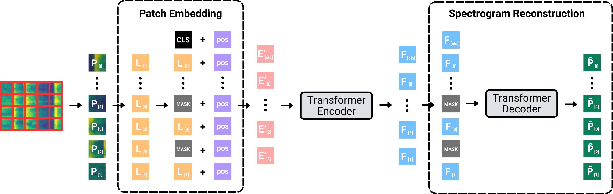
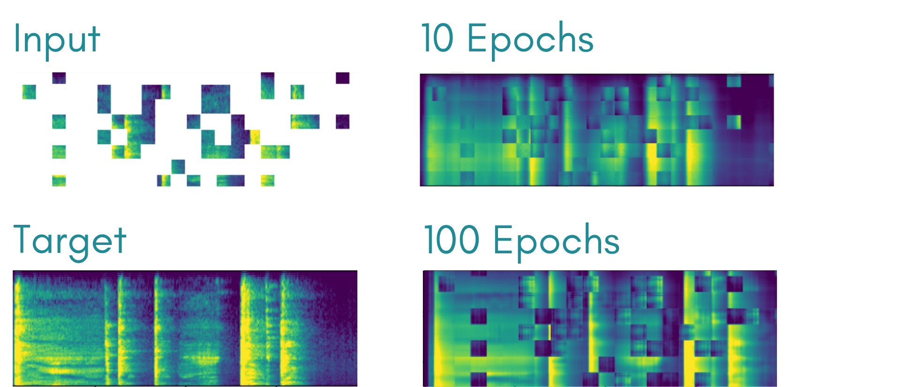

# CoughViT

## A Self-Supervised Vision Transformer for Cough Audio Representation Learning**

## Abstract

Physicians routinely assess respiratory sounds during the diagnostic process, providing insight into the condition of a patient’s airways. In recent years, AI-based diagnostic systems operating on respiratory sounds, have demonstrated success in respiratory disease detection. These systems represent a crucial advancement in early and accessible diagnosis which is essential for timely treatment. However, label and data scarcity remain key challenges, especially for conditions beyond COVID-19, limiting diagnostic performance and reliable evaluation.

In this paper, we propose CoughViT, a novel pre-training framework for learning general-purpose cough sound representations, to enhance diagnostic performance in tasks with limited data. To address label scarcity, we employ masked data modelling to train a feature encoder in a self-supervised learning manner. We evaluate our approach against other pre-training strategies on three diagnostically important cough classification tasks. Experimental results show that our representations match or exceed current state-of-the-art supervised audio representations in enhancing performance on downstream tasks.

## Architecture



*Masked data modelling architecture: patches are masked, encoded by the transformer, and reconstructed by the decoder.*

## Pre-training



*Spectrogram reconstruction over 100 epochs of self-supervised pre-training.*

## Results

We evaluate CoughViT on three diagnostically important cough classification tasks. Our self-supervised, domain-specific pre-training approach matches or exceeds state-of-the-art supervised audio representations.

| Model | Pre-training Dataset | Self-Supervised | COVID-19 Detection | Cough Detection | Wet-or-Dry |
|-------|---------------------|----------------|-------------------|-----------------|------------|
| ViT | None | ✗ | 56.19 | 97.24 | 60.06 |
| ViT | C19-Sounds | ✗ | 59.22 | 95.89 | 58.95 |
| AST | Audioset | ✗ | 70.63 | **98.73** | **78.95** |
| **CoughViT** | C19-Sounds | ✓ | **73.21** | 98.25 | 74.95 |

*AUROC (%) after fine-tuning on downstream tasks. CoughViT outperforms all baselines on COVID-19 detection and matches state-of-the-art AST-Audioset despite being trained on a smaller, unlabelled dataset using self-supervised learning.*

### Blind Test Results

COUGHVID Wet-or-Dry Classification:

| Model | AUROC |
|-------|-------|
| Logistic Regression | 0.59 |
| AST-Audioset | 0.56 |
| **CoughViT** | **0.71** |

Edge-AI Cough Detection:

| Model | Event-based F-1 | Sample-based F-1 |
|-------|----------------|------------------|
| AST-Audioset | **0.71** | **0.59** |
| CoughViT | 0.69 | 0.57 |

## Citation

```
@inproceedings{luong2025coughvit,
  title={CoughViT: A Self-Supervised Vision Transformer for Cough Audio Representation Learning},
  author={Luong, Justin and Xue, Hao and Salim, Flora D},
  booktitle={Proceedings of the 2025 ACM International Symposium on Wearable Computers},
  pages={45--52},
  year={2025}
}
```
